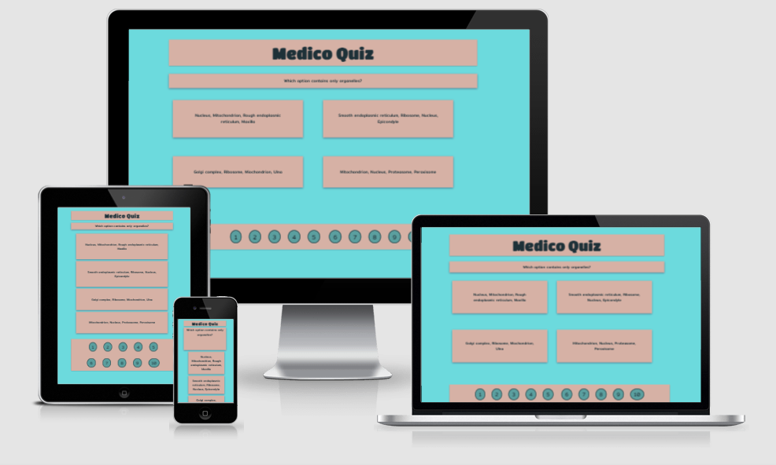
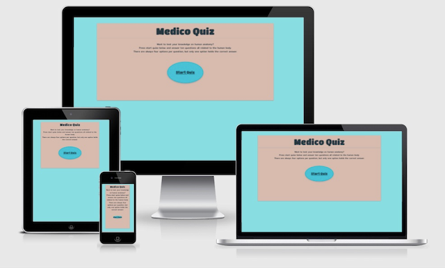
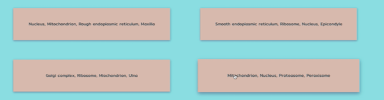
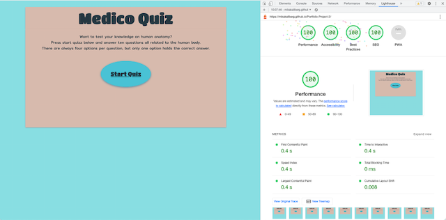
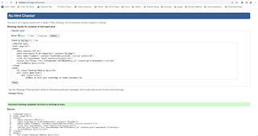
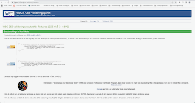
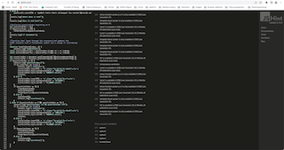
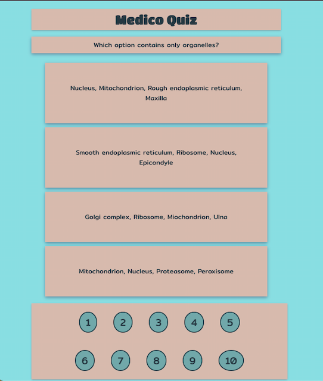

# the Medico Quiz
Medico Quiz an interactive question game where the user can test their knowledge on human anatomy and physiology. 
The difficulty level is such that both beginners and professionals hopefully can enjoy it.
The target audience is international and for all ages.
The goal of the layout is to add a calm atmosphere for the user.
 

### Features
An overview of the existing features and possible improvements
### Existing features

__The Welcome page__

- Heading

Featured at the top of the page is the heading text, the design is meant to be fun, but clean and easy to understand and see.

- Description and Rules

As the intent of this quiz is for something to do while relaxing, the rules are kept few and direct, 
to give the user the relevant information of what to expect when they press start quiz in a consice maner.

- Start Quiz area

The start quiz button is the focus of the page, it's styled to stand out from its background. 
When hovering over the area the item raises up slighty, with shadow and an increase in of size. The cursor changes from an arrow to a hand. All to signal to the user that there is something clickable here.
The size of the start quiz area changes size depending of which screen size this quiz is viewed, on the smallest screens the description and rules are more in focus, to have better readability.

__The Quiz page__
- question area

When the user comes to the Quiz page, the over all design is the same, to continue the same feel of the Welcome page.The heading is the same.
The design is still clean, it's easy to find information and get going intuitively.
The first question is displayed immediately and the quiz has started. 
Since this game is to relax and not stress, but get a little bit of a challenge, there is no timer, the user can take all the time they want.
The questions are a bit challenging, in the testing fase, people who do not have a medical background have scored 5 out of 10. 
The question area changes size depending on the size of the screen.
The questions are rendered from JavaScript together with the options. 
The question area is also the target JavaScript uses to display the users score after the last question is answered.
The users total score is displayed together with three different message options, depending on the scoretotal. This is also rendered through JavaScript.
At the end of each sentence is the offer to play again, this transports the user back to the welcome page, so they can initate a new start.

- options area

There are four options for each question and they are displayed in their own box. These boxes change apperance and position with screen size, but do not overlap.
When hovered over the boxes are raised slightly, with a shadow, and increase in size and the cursor changes from an arrow to a hand. To indicate to the user that they can push something and what they are pushing. The option areas indiviual elements are rendered by JavaScript. Which is why the HTML only contains the outer Div to act as a target for JavaScript.
When the user presses an option the board clears and a new question with options appear.

- score area

The score area is where the user can keep track of which question they are on and if the option they selected was correct or not. 
Initially the buttons are numbered, as the user progresses in the game, the buttons change design to give feedback about correct or incorrect answer.
The next question gets called automatically. All of this is rendered from JavaScript, the divs with the IDs score-line-1 and score-line-2 are the targets for JavaScript.

### Features left to implement

There are some features that was planned, but not created.
- An optional High Score page, so the user would be able to compare their result with others if they like.
- An indication for the user on which is the correct answer.

### Possible improvments
- The biggest improvement that could be done is to build the website for mobile first and then alter it in media query for browser window.
- The CSS could improve, there are little irregularities in the spacing and margins for the option area. 
   The score buttons are slightly different. The score area gets left at the bottom on some smaller screens.
   I was unable to work out display flex, justify content with text-align center.
- All of the elements could have been placed in one outer div, and then spans could have been used for question and score area.
   This would have made it easier to hold them together when the board cleares and the screen size changes.
- The JavaScript could have been structured better, from the question area down, instead of score area down. For easier readability and to counter possible future bugs.
   It is still understandable for other more experienced coders, but there is room for improvement on the JavaScript code.

### Validator testing

- I got my first fireworks in Lighthouse.

- The site is deployed via GitHub pages ucessfully: https://mikakallberg.github.io/Portfolio-Project-2/
- The site http://ami.responsivedesign.is/# was used to test if the code was responsive on different screens, see images above.
- DevTools have been used extensively to ensure that no objects are covering another object in different screen sizes. The score area ends up far down on the page on some screens sizes. Improvments can be made as stated above.
- HTML code for both index.html and quiz.html have been passed through W3C validator with no errors. (https://validator.w3.org/)
- CSS code has been passed thorugh W3C (Jigsaw) validator with no issues found. (https://jigsaw.w3.org/css-validator/)
- JavaScript has been passed through JSHint, and came back with 5 variables unused. (https://jshint.com/)
  - Option1
  - Option2
  - Option3
  - Option4
  - handleCheck

   These are called and activated while running, as such they are used even though it is not picked up in JSHint. 
   If this product could have been done again with more time, another way would probably have been found.

### Functionality on different browsers and screen sizes
- down to a 1000px in width the layout is as shown above. From a 1000px and down the question area boxes are displayed one after the other instead of two in a row. 
To maintain easy readability for the user. The alignment for the rest of the content stays the same, the space between the score area and the rest of the content varies depending on screen size and if the quiz is active or the total score is shown.

### Bugs while working
- The initial passing of index.html revealed a closing div that was added to line 21 at the end of an link attribute. This was solved.
- JavaScript was hard to put together and understanding why to use different methods and functions, understanding the different pieces was okey. 
But to then put it together as a whole and why, I had a lot of problem with. 
So there where numerous bugs while working. Everything from calling the functions, to finding a good strategy to build the code itself.  
The most interesting bug was at the end, where one x was missing from line 275 in the rendering of option text. The error message in console only reffered to a general error, nothing specific.

### Unfixed bugs
- As of now there are no unfixed bugs that have been found in the different testing. 

### credits
- Special thanks to:
  My mentor Spencer Barriball for being there, healping me to understand why and connecting the dots of JavaScript.
  Alumni Bim Williams (GitHub: mrBim) for teaching me to truly go through my JavaScript code methodically looking for problems
  and for showing me so many tools that are at my disposal in GitPod and other websites to practise coding. I wish I would have talked to him sooner.
  Fellow students:
   Mats Simonsson (GitHub: Pelikantapeten) for the good advice and talks.
   Dylan (GitHub: dylan097) for testing and finding problems in my CSS layout on small screens.
   Dave Horrocks for taking my site through the ringer, also thank you for all the advice on CSS, I wish I had asked him sooner.
   Frankie Sanjana (GitHub frankisanjana) and Gina for trying my quiz and giving me feedback.
   And many many more of my fellow students and others on Slack, for the company and good talks, for trying my quiz.
- for code on the different shadows credit is given to: https://getcssscan.com/css-box-shadow-examples
- Brian Design (https://www.youtube.com/watch?v=f4fB9Xg2JEY*/) where I was able to get an idea of how to construct a quiz.
- freeCodeCamp.org (https://www.youtube.com/watch?v=PkZNo7MFNFg) going through the majority of this video helped me practice and understand more.
- https://developer.mozilla.org/en-US/ (never used to copy paste a code but to answer question on what something is)
- https://www.w3schools.com/ (never used to copy paste a code but to answer question on what something is)
- https://stackoverflow.com/ (never used to copy paste a code but to answer question on what something is)
- https://www.diffchecker.com/diff (was used so spot the difference at the end when one code worked and the other didn't)
- https://www.thesitewizard.com/webdesign/create-good-filenames.shtml
- https://html.com/semantic-markup/
- https://www.sitepoint.com/simple-javascript-quiz/
- https://github.com/Code-Institute-Solutions/readme-love-maths/blob/master/README.md (followed to write this README)
- Love-Maths tutorial used to code alongside, for work structure.
- https://trends.google.com/trends/explore?q=quiz,medical%20quiz,game,quiz%20game,medical%20game (to pick keywords for meta-element)

### content (sources for questions)
- Color palette was picked from this source: https://colorswall.com/palette/6138 
- Colors was then chosen with https://www.w3schools.com/colors/colors_picker.asp
- Questions and answers are taken from Tortora's Principles of Anatomy and Physiology (G.J Tortora and B.H Derrickson, 15th Global edition (2017)) and 
Sobotta Atlas of Human Anatomy (ed. F. Paulsen and J. Waschke. 15th edition with English Nomenclature and Latin Nomenclature(2011))

### media
https://fontawesome.com
- all images in this README have been produced by me (GitHub: mikakallberg).

Thank you for your time!

